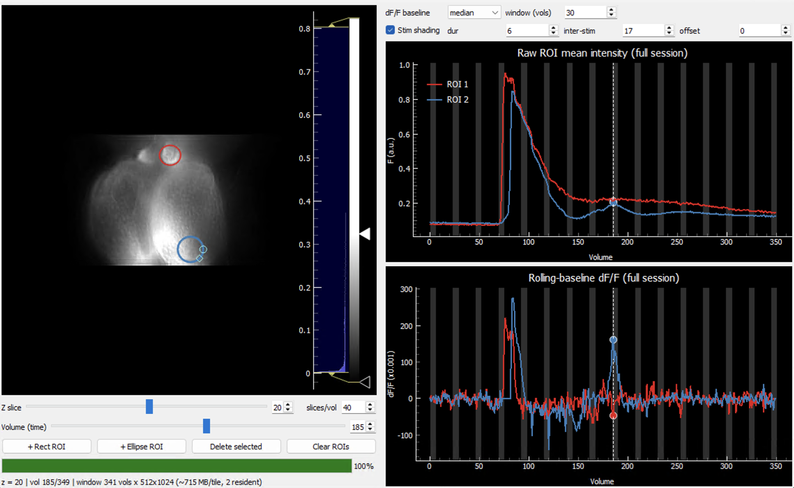

# show4Dbrain

A memory-efficient GUI for browsing large 4D image stacks (`Y × X × Z × T`)
stored as a single 3D array in an HDF5 / MATLAB v7.3 `.mat` file, and for
pulling full-length ROI time-series with raw and rolling-baseline `dF/F`
traces.

It was written for volumetric calcium imaging, but nothing in it is specific to
any modality, organism, or file size — it works on any 3D array that is a stack
of 2D frames over time, grouped into volumes.

## How it stays light on memory

The whole array is never loaded. Two independent mechanisms keep RAM bounded:

- **Image = a sliding window of volumes.** Only a few "tiles" for the current Z
  are kept resident. The window size is chosen automatically so the resident
  image memory stays near a fraction of free RAM (default **25%**, set with
  `--ram-frac`). Neighbouring tiles are prefetched in the background so scrubbing
  stays smooth. This is independent of the recording length.
- **Traces = full length, read smart.** An ROI is a small bounding box, so its
  time-series is read straight from disk one sub-rectangle per volume (kilobytes
  per ROI), never whole frames. The trace spans the entire recording and the
  time-slider dot scrubs across all of it. Moving one ROI re-reads only that
  ROI's footprint.

Resident memory ≈ a few image tiles (~25% of free RAM) + tiny per-ROI trace
vectors — regardless of how big the file is or how long the recording.

## Data model

```
n_volumes = T // slices_per_volume
frame index for slice z, volume v  =  v * slices_per_volume + z
```

The largest array dimension is treated as time. `slices_per_volume` is whatever
your acquisition used (set on the command line or live in the GUI). For a plain
2D-over-time movie with no z-stack, set `slices_per_volume = 1`.

## Requirements

- Python 3.8+ (3.10–3.12 recommended)
- `h5py`, `numpy`, `scipy`, `pyqtgraph`, `PyQt5`
- optional: `psutil` (for RAM-aware window sizing; falls back to 8 GB if absent)

## Install

```bash
python -m pip install --upgrade pip
pip install h5py numpy scipy pyqtgraph PyQt5
pip install psutil          # optional but recommended
```

(Use a virtual environment if you like: `python -m venv .venv` then activate it.)

## Run

```bash
python show4dbrain.py                      # opens a file picker
python show4dbrain.py --file your_stack.mat
```

The variable inside the file is auto-detected (largest 3D dataset); override with
`--var` if needed.

### Flags
| Flag | Meaning | Default |
|------|---------|---------|
| `--file PATH` | Path to the `.mat` file (omit for a file picker) | file picker |
| `--var NAME` | Variable (dataset) name inside the file | auto-detect |
| `--spv N` | Slices per volume | `40` |
| `--ram-frac F` | Fraction of free RAM for the image window | `0.25` |
| `--no-transpose` | Don't transpose frames (use if the image looks rotated 90°) | off |

`--spv` is only a starting value; slices-per-volume is also editable live in the GUI.

## Using the GUI



- **Z slice** — choose the optical plane. Switching planes reloads the image
  window (tiles are slice-specific).
- **slices/vol** — slices per volume; changing it re-slices and reloads.
- **Volume (time)** — scrub through volumes. The image window follows; crossing a
  tile boundary briefly loads the next chunk (prefetched when possible). You can
  also drag the dashed line on the raw trace to scrub.
- **+ Rect ROI / + Ellipse ROI** — drop an ROI (resize via its corner handles).
- **Delete / select ROIs** — click an ROI to select it, then `Del` / `Backspace`
  or **Delete selected**; right-click → **Remove** also works; **Clear ROIs**
  removes all.
- **Trace plots** — full-session raw mean intensity (top) and rolling-baseline
  `dF/F = (F − F0) / F0` (bottom); the dot marks the current volume.
- **dF/F baseline** — `mean`, `median`, or `pct_10` / `pct_20`; **window (vols)**
  sets the rolling window. Changes recompute instantly (no disk re-read).
- **Stim shading** — set **dur** (event ON), **inter-stim** (OFF gap) and
  **offset** in volumes; grey bands appear on both trace plots.
- **Histogram bar** (right of the image) — display contrast only.

## Troubleshooting

- **`No such file or directory`** — wrong path; use the file picker or a full path.
- **Image looks rotated 90°** — add `--no-transpose`.
- **`Variable '...' not found`** — the error lists available names; use `--var`.
- **Won't open / not HDF5** — pre-v7.3 `.mat`; re-save in MATLAB:
  `save('file.mat','VarName','-v7.3')`.
- **Scrubbing hitches every N volumes** — that's a tile boundary load. Increase
  `--ram-frac` for larger windows (fewer boundaries) if you have the RAM.
- **First read of a plane is slow** — MATLAB v7.3 files are often gzip-chunked;
  the first read pays a decompression cost, then it's fast.
