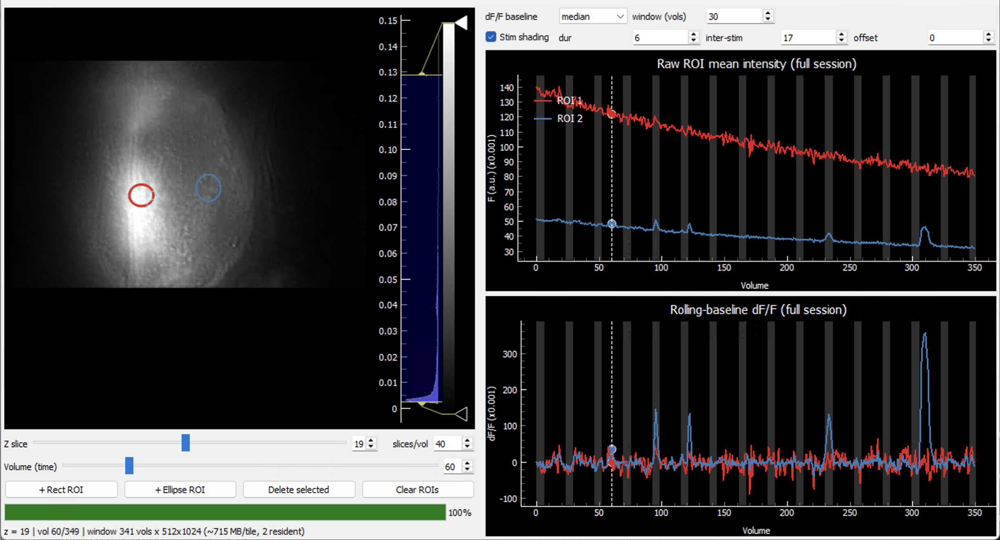

[](https://doi.org/10.5281/zenodo.21825885)

# show4Dbrain

A memory-efficient GUI for browsing large 4D image stacks (`Y × X × Z × T`)
stored as a single 3D array in an HDF5 / MATLAB v7.3 `.mat` file, and for
pulling full-length ROI time-series with raw and rolling-baseline `dF/F`
traces.

It was written for volumetric calcium imaging, but nothing in it is specific to
any modality, organism, or file size — it works on any 3D array that is a stack
of 2D frames over time, grouped into volumes.

## How it stays light on memory

The whole array is never loaded. Two independent mechanisms keep RAM bounded:

- **Image = a sliding window of volumes.** Only a few "tiles" for the current Z
  are kept resident. The window size is chosen automatically so the resident
  image memory stays near a fraction of free RAM (default **25%**, set with
  `--ram-frac`). Neighbouring tiles are prefetched in the background so scrubbing
  stays smooth. This is independent of the recording length.
- **Traces = full length, read smart.** An ROI is a small bounding box, so its
  time-series is read straight from disk one sub-rectangle per volume (kilobytes
  per ROI), never whole frames. The trace spans the entire recording and the
  time-slider dot scrubs across all of it. Moving one ROI re-reads only that
  ROI's footprint.

Resident memory ≈ a few image tiles (~25% of free RAM) + tiny per-ROI trace
vectors — regardless of how big the file is or how long the recording.

## Data model

```
n_volumes = T // slices_per_volume
frame index for slice z, volume v  =  v * slices_per_volume + z
```

The largest array dimension is treated as time. `slices_per_volume` is whatever
your acquisition used (set on the command line or live in the GUI). For a plain
2D-over-time movie with no z-stack, set `slices_per_volume = 1`.

## Requirements

- Python 3.8+ (3.10–3.12 recommended)
- `h5py`, `numpy`, `scipy`, `pyqtgraph`, `PyQt5`
- optional: `psutil` (for RAM-aware window sizing; falls back to 8 GB if absent)

## Install

```bash
python -m venv .venv
# PowerShell
Set-ExecutionPolicy -Scope Process -ExecutionPolicy RemoteSigned
.\.venv\Scripts\Activate.ps1
# macOS / Linux
# source .venv/bin/activate
python -m pip install --upgrade pip
python -m pip install -r requirements.txt
```

If you do not already have `requirements.txt`, create it once with:

```bash
python -m pip install --upgrade pip
pip install h5py numpy scipy pyqtgraph PyQt5 psutil
pip freeze > requirements.txt
```

## Run

```bash
python show4dbrain.py                      # opens a file picker
python show4dbrain.py --file your_stack.mat
```

The variable inside the file is auto-detected (largest 3D dataset); override with
`--var` if needed.

### Flags

| Flag             | Meaning                                                     | Default     |
| ---------------- | ----------------------------------------------------------- | ----------- |
| `--file PATH`    | Path to the `.mat` file (omit for a file picker)            | file picker |
| `--var NAME`     | Variable (dataset) name inside the file                     | auto-detect |
| `--spv N`        | Slices per volume                                           | `40`        |
| `--ram-frac F`   | Fraction of free RAM for the image window                   | `0.25`      |
| `--no-transpose` | Don't transpose frames (use if the image looks rotated 90°) | off         |

`--spv` is only a starting value; slices-per-volume is also editable live in the GUI.

## Using the GUI



- **Z slice** — choose the optical plane. Switching planes reloads the image
  window (tiles are slice-specific).
- **slices/vol** — slices per volume; changing it re-slices and reloads.
- **Volume (time)** — scrub through volumes. The image window follows; crossing a
  tile boundary briefly loads the next chunk (prefetched when possible). You can
  also drag the dashed line on the raw trace to scrub.
- **+ Rect ROI / + Ellipse ROI** — drop an ROI (resize via its corner handles).
- **Import 3D ROIs...** — load the significant ROI candidates from a
  MATLAB v7.3 analysis payload. The viewer automatically looks relative to the
  selected payload for the related `hex_rois.mat` mask file.
  Dashed contours are available candidates; click anywhere inside one to add
  its trace. The active contour becomes solid. Click it again to remove its
  trace while leaving the candidate available. Imported contours appear only
  on their analysis Z plane. They are colored by cluster when cluster metadata
  is available, or by individual ROI otherwise.
- **Delete / select ROIs** — click an ROI to select it, then `Del` / `Backspace`
  or **Delete selected**; right-click → **Remove** also works; **Clear ROIs**
  removes manually drawn ROIs and all active traces. Imported candidate
  contours remain available until **Unload imported** is pressed.
- **Trace plots** — full-session raw mean intensity (top) and rolling-baseline
  `dF/F = (F − F0) / F0` (bottom); the dot marks the current volume.
- **dF/F baseline** — `mean`, `median`, or `pct_10` / `pct_20`; **window (vols)**
  sets the rolling window. Changes recompute instantly (no disk re-read).
- **Stim shading** — set **dur** (event ON), **inter-stim** (OFF gap) and
  **offset** in volumes; grey bands appear on both trace plots.
- **Histogram bar** (right of the image) — display contrast only.

### Post-analysis ROI import

The importer needs three pieces of information: the image stack already open in
show4Dbrain, an analysis payload identifying the significant ROIs, and the
logical pixel masks for those ROIs. It does **not** need a saved dF/F file.

#### 1. Analysis payload

The recommended minimal MATLAB v7.3/HDF5 payload contains:

| Variable  | Meaning                                              |
| --------- | ---------------------------------------------------- |
| `sig_idx` | One-based flattened indices of the significant ROIs  |
| `N_Z`     | Number of Z planes represented by the ROI collection |
| `N_ROIS`  | Number of ROI masks per Z plane                      |

`sig_idx` uses the following MATLAB-style, one-based mapping:

```text
sig_idx = (z_plane - 1) * N_ROIS + roi_number
```

where `z_plane` is `1..N_Z` and `roi_number` is `1..N_ROIS`.

`N_Z` and `N_ROIS` are always required. Cluster analysis is optional when
`sig_idx` is supplied. A payload may additionally contain:

| Variable         | Optional or conditional use                                                                                      |
| ---------------- | ---------------------------------------------------------------------------------------------------------------- |
| `cluster_labels` | One cluster number per flattened ROI; enables cluster colors and names. Required only for the fallback below     |
| `cluster_sig`    | Logical flag for each cluster. Used with `cluster_labels` to derive significant indices when `sig_idx` is absent |
| `cluster_p`      | Cluster-level p-values shown in ROI tooltips                                                                     |
| `cluster_masses` | Cluster masses shown in ROI tooltips                                                                             |

Therefore, a payload without `sig_idx` is also valid, but only when it contains
both `cluster_labels` and `cluster_sig`. Other analysis fields are allowed but
ignored by the importer.

#### 2. ROI mask source

The exact logical masks must be stored in a top-level variable named
`hex_rois`. Despite the historical name, these are simply ROI masks: an outer
MATLAB cell array with one entry per Z plane, where each plane contains
`N_ROIS` logical `H x W` masks. The mask dimensions must match the displayed
image stack.

`hex_rois` can be inside the selected payload itself. Otherwise, place it in a
separate file named exactly `hex_rois.mat`. After a payload is selected, the GUI
searches in this order:

1. A top-level `hex_rois` variable inside the selected payload.
2. `hex_rois.mat` in the same directory as the selected payload.
3. `hex_rois.mat` in each nearest parent directory, walking upward. For the
   WIDE-CAT layout this finds `dfF/hex_rois.mat` from a payload nested below
   `dfF/paper_figures_/...`.
4. If automatic search finds nothing, a second file picker asks for the mask
   file.

This search is relative to the selected payload, not to the terminal's current
working directory.

A typical WIDE-CAT result tree therefore works without moving or copying files:

```text
dfF/
├── hex_rois.mat
└── paper_figures_/
    └── CLUSTER_.../
        └── PAYLOAD_CLUSTER_fish004.mat
```

Here the GUI starts beside `PAYLOAD_CLUSTER_fish004.mat`, checks
`CLUSTER_.../`, then `paper_figures_/`, and finds the nearest
`hex_rois.mat` when it reaches `dfF/`.

#### 3. Trace calculation

Set **slices/vol** to the same value as payload `N_Z` before importing. Trace
data is loaded lazily: importing contours does not read every full-session
trace. Only clicking a candidate reads that ROI's bounding box at its fixed Z
plane. Display binning changes the drawn contour but trace extraction continues
to use the full-resolution saved mask. Raw `F` is calculated as the mask's mean
pixel value in the open image stack. Rolling-baseline dF/F is then calculated
inside show4Dbrain using the GUI's baseline method and window.

Because show4Dbrain recomputes these traces, its dF/F can differ from the values
used by an upstream analysis that applied background correction, high-pass
filtering, or a different baseline definition.

## Troubleshooting

- **`No such file or directory`** — wrong path; use the file picker or a full path.
- **Image looks rotated 90°** — add `--no-transpose`.
- **`Variable '...' not found`** — the error lists available names; use `--var`.
- **Won't open / not HDF5** — pre-v7.3 `.mat`; re-save in MATLAB:
  `save('file.mat','VarName','-v7.3')`.
- **3D ROI import reports a shape mismatch** — verify that the payload and
  `hex_rois.mat` belong to the displayed stack. If both image and contours look
  transposed, use or remove `--no-transpose` consistently.
- **3D ROI import reports a Z mismatch** — set **slices/vol** to the payload's
  `N_Z`, then import again.
- **Scrubbing hitches every N volumes** — that's a tile boundary load. Increase
  `--ram-frac` for larger windows (fewer boundaries) if you have the RAM.
- **First read of a plane is slow** — MATLAB v7.3 files are often gzip-chunked;
  the first read pays a decompression cost, then it's fast.
- **Have another issue or feature request?** — Please create a new issue! Thank you! :)

## Citation

Gokul Rajan. (2026). show4Dbrain: A Lightweight Tool for Visualizing 4D Functional Imaging Data (Version v2.0.0) [Computer software]. Zenodo. https://doi.org/10.5281/zenodo.21825886
